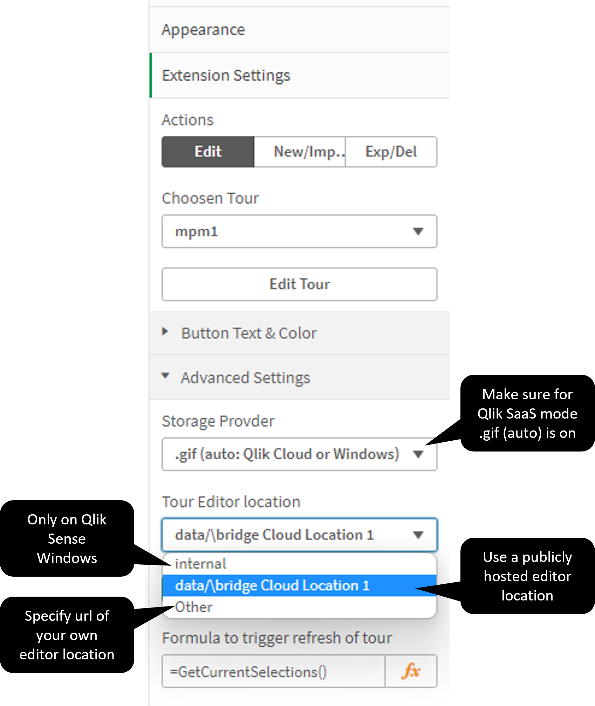

# Documentation

## Use on Qlik SaaS (qlikcloud.com)

The extension can be used on Qlik Cloud editions as well. For the users it will work with *no further* configuration. If you want *to edit* the tour 
(=develop the tour content on qlikcloud.com) you need to 
 * either use the databridge host qs-i-dev.databridge.ch
 * or deploy the editor folder from this repo on a web server of your choice and specify the url under "other"


 
 * set a CSP (Content Source Policy) in the cloud management console to whitelist the origin of the editor
 
The reason for this is, that the editor has quite some source code and dependencies, therefore it is kept within an iframe. Unlike Qlik Sense Windows 
Servers, Qlik Cloud doesn't act as a web-server for html files, the iframe content needs to be sourced from another host. 

```
Note: there is no data being sent to that web host origin, just the html, css and js files are being loaded
```
You can prove this in the browser's Network Monitor, that traffic is going to the editor's 

